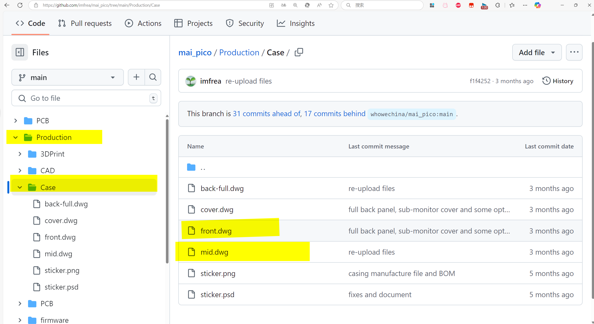
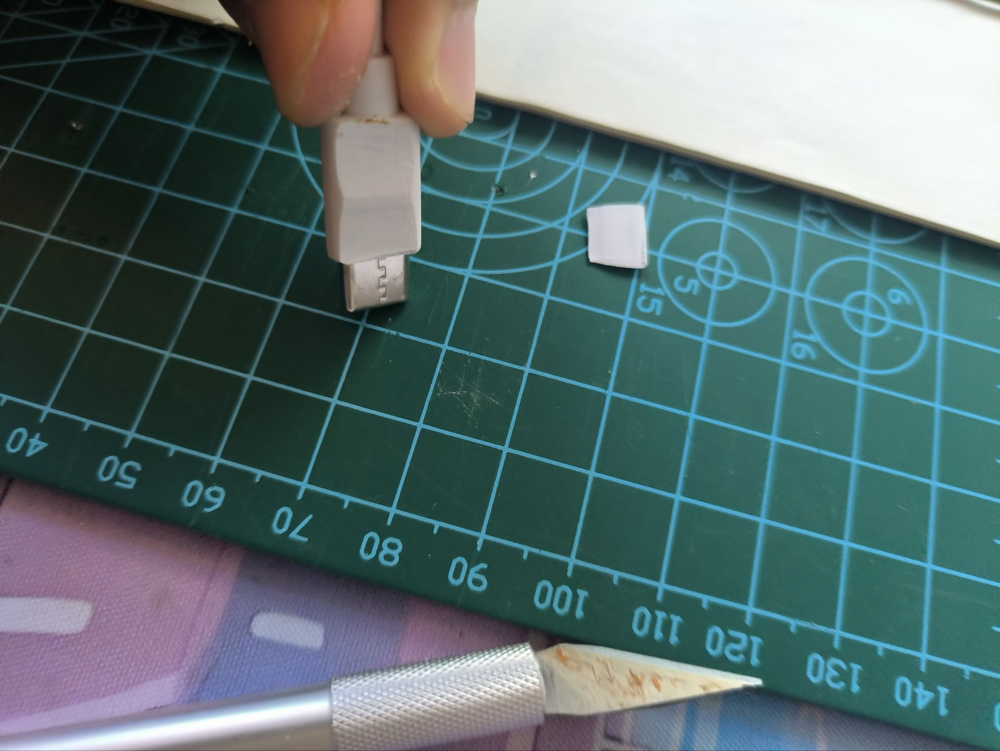
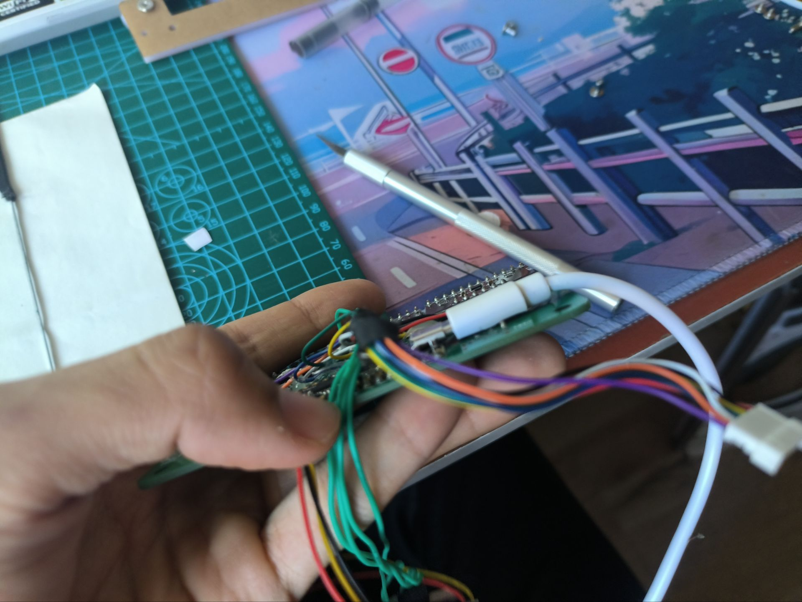
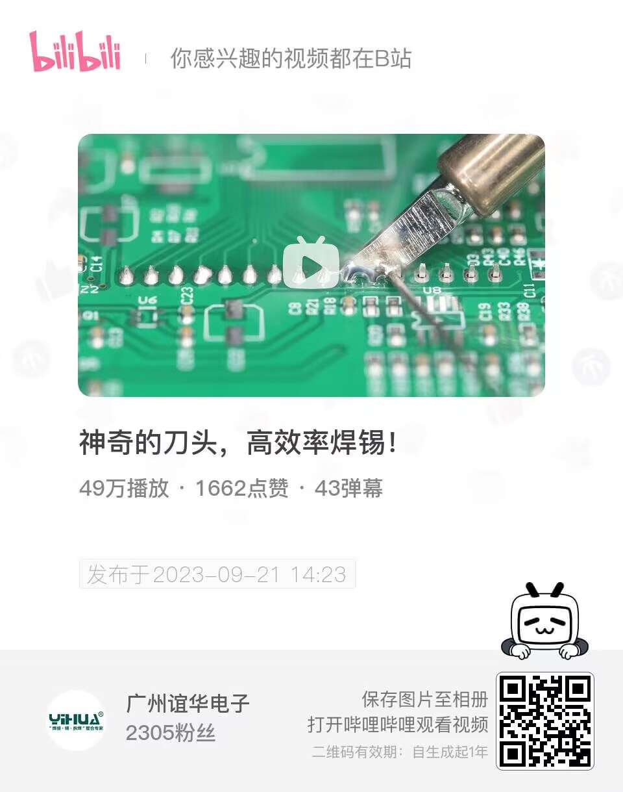
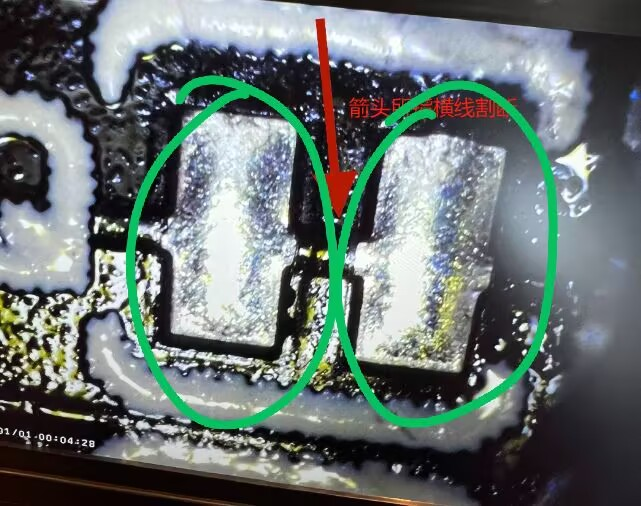
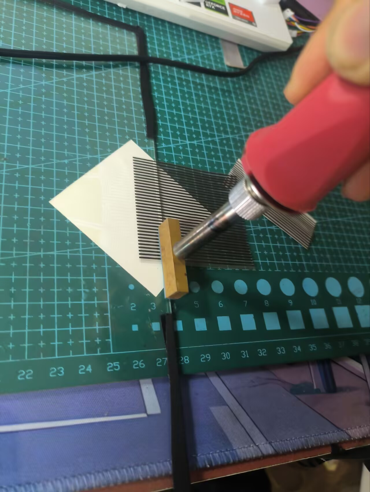
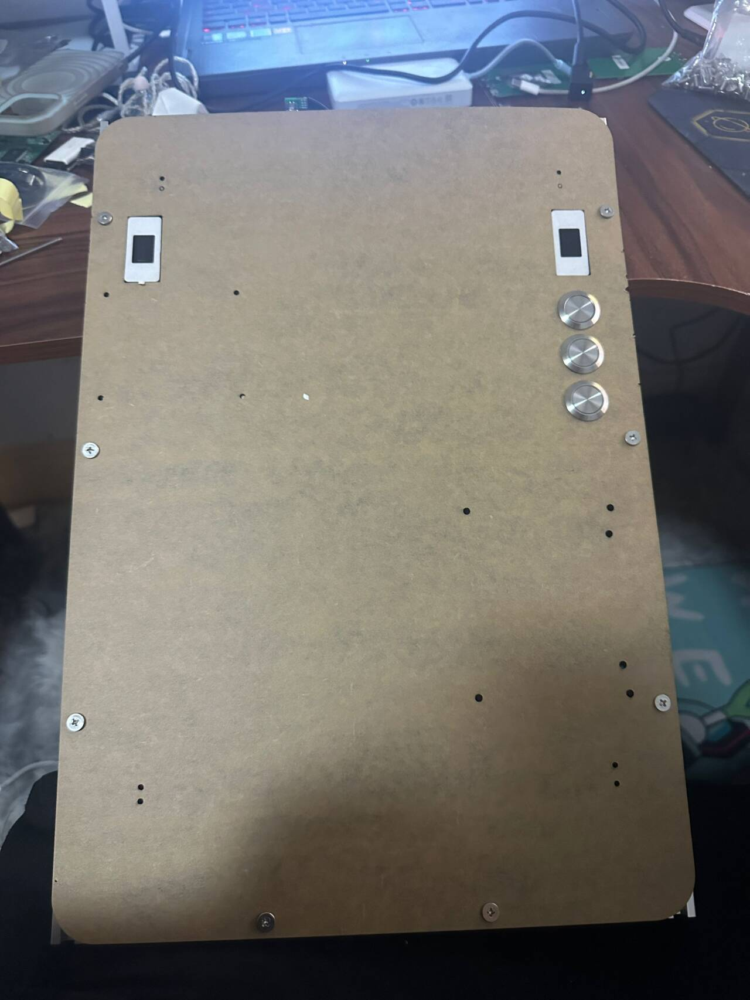

# 壹：maipico概述
点击红色按钮可以展开大纲，更方便地阅读


请事先完整阅读一遍该文档！

有些地方比如**显示器**，在多处提及

`文章前半部分省略的后半部分可能详细提及`

请事先完整阅读一遍该文档可以节约后期大量时间

## Q＆A

Q: 原神是什么？
	A: 这是唯一需要自行理解的词，以及在任何社区，群聊请不要直接提起原神（游戏程序）内容

Q: 这是什么？
	A: 项目作者是[whowechina](https://github.com/whowechina/mai_pico)，这是maipico控制器，在电脑上运行游戏，投屏到maipico显示器上，也就是除了maipico，还需要有一台运行游戏的电脑

Q: 成本?
	A: 全部最低配750元以下（包括试错和工具，不包括打碎玻璃）加背板和彩色亚克力装饰大约800元

Q: 制作时间?
	A: 快的话一周，慢慢来最多半个月（主要是等快递）（如果东西都到了而且步骤都知道，一个下午即可）

Q: maipico分成哪几部分?
	A：电路，ito玻璃，3d打印，外壳，显示器（按照步骤分）

Q：还是不会怎么办
	A：优先看下面第七条**互补教学**，然后进群里或者评论区提问，提问请①附带前因后果②附带对焦清楚，截图清晰的图片or视频③提问的智慧.pdf④提问的时候不要什么都来问，比如玻璃沾上灰了还能用吗，连锡了是不是要直接丢掉这种问题。。。大部分的小东西可以自己搞明白

## 概述

```
这个系列教程打算做成系列短视频
```
教程分成**制作，问题，入门**，层层递进
1. **制作**会省去所有概念性部分，从0制造一个能玩的maipico
2. 不过省去原理，做手台会变成做bug，所以有了**问题**一节
3. **入门**则是了解maipico 电路板工作原理，以及自己用软件制作外壳，3d建模，画电路板
4. 如果你喜欢这种做电子手工创造的乐趣，想了解其工作原理，欢迎制作完maipico之后进入**入门**一节
5. 升级是用来自己制作外壳，铝型材，做出改变
6. 与此同时，欢迎接触更多开源项目！example:
7. 互补教程：
	- [空游石非的bilibili视频](https://www.bilibili.com/video/BV1oS42197P7)
	- github你能找到更多细节补充（互补），[whowechina](https://github.com/whowechina/mai_pico)是maipico项目的源作者，他的的项目文件往往是最新的。
	- 你能找到另一个分支找到[imfrea](https://github.com/imfrea/mai_pico)的项目，这是一位群友，他的**Readme_cn**教程更为详细，并在production文件夹下附带了他制作并开源的简易外壳文件，简易外壳文件的打样方法在本文的`叁.<3>.7`
	- [这是我此前在b站做的一点视频，没有太多内容，但看看应该也有帮助](https://www.bilibili.com/video/BV1WiewedEbr/)
8. 你可能需要下载github下的文件用于制作参考，或者发给商家打样，下载方法请参考[b站视频](https://search.bilibili.com/all?vt=114514&keyword=github%E6%96%87%E4%BB%B6%E4%B8%8B%E8%BD%BD%E6%96%B9%E6%B3%95)

值得一提的是：不用看懂**入门**，只需要看**制作**，一样能做出maipico


# 贰：防护

```
因为这个教程面向大众
所以我在此必须列出我已知的安全须知
```
## Ⅰ. 护具
- 劳保手套（**必须**）（铝型材，电烙铁，按键环等大力出奇迹的地方，如果可以的话请全过程佩戴劳保手套以防万一）


```
焊接请尽量在通风的环境下进行
理由：
1. 焊锡丝为了助焊，会有一定比例的松香，吸入过多对肺部有害
2. 焊锡丝会发出的烟含有重金属，吸入过多对人体有害
3. 不过也不必太过恐慌，只要不是怼着焊锡烟大量吸问题就不大
4. 考虑下面30元的排风扇，相对800元的maipico来说有点多，如果在自己房间里制作，没有排风扇的情况下，务必打开风扇，开门开窗并保持通风
```

- 大功率***排***风扇（**建议**）（如果在自己房间而不是工作室）参考图：

```
本应该非常建议自制排风扇，性价比高，大功率应该会花费40元以下
但有一个问题：市面上单独买到的**方转圆法兰导风桶**都不带万向架的安装孔，所以建议直接买成品

自制排风扇
采购清单
1. 220v转12v可调变压电源
2. 12v4.8a12*12cm排风扇（带防护网）
3. 方转圆法兰导风桶（不知道怎么叫）（带固定螺丝和万向架螺丝孔）
4. 万向架
5. 锡箔导风管（不确定长度3m以上最佳）
```

- 如果你有自己的工作室而不是房间，可以**风扇**开吹风挡避免吸入体内，并保持工作室通风

- n95口罩或者防毒面具（焊锡烟，530清洁剂）

- 丁腈手套（ito玻璃）
防止指纹，汗液油脂沾到ito玻璃上，同时比劳保手套薄，起一定的保护作用


## Ⅱ. 烫伤的处理办法

常见于
* **电烙铁**不小心碰到手
* 手不小心碰到**没有冷却的加热台**

被烫了，不管有没有破皮，必须第一时间放下手上的工作，打开水龙头，用流动的凉水冲15min以上

如果已经起水泡了，不要扣破，如果一天之后水泡仍然存在，用消毒过的针扎出一个小孔排出水（不要撕开，排水即可），并且用碘伏消毒

如果只是起白斑点，仅用凉水冲洗，不要搓（变白的皮肤非常脆弱，一搓就掉），冷却之后伤口才不会留疤

## Ⅲ. 划伤的处理办法

* 常见于亚克力边缘（使劲按或者用力不当）
* 铝型材边缘（使劲按或者用力不当）
* 电动螺丝刀使用不当

涂抹部分碘伏并保持伤口干燥


## Ⅳ. 注意事项
时刻注意电烙铁，加热板，热风枪等发热器件**开关**和**电源**是否通电

时刻注意电烙铁是否放置稳定，是否有倒下来的风险，电烙铁离手即关闭开关！

时刻注意**电烙铁**和**排风扇扇叶**之间的距离
时刻注意**电烙铁**和**手**的距离
时刻注意
注意镊子尖头不要戳手上

有两个伤正常，吃一堑长一智，不要吃一堑吃一堑吃一堑吃一堑吃一堑吃一堑吃一堑吃一堑吃一堑吃一堑吃一堑光顾着库库吃了

# 叁：制作
## Ⅰ. 从0沉浸式制作一台maipico
### 一. 采购
1. 第一种：全部一并采购制作
	如果下定决心要做完，直接按照**群内采购清单.txt**采购即可，这里对**采购清单.txt**进行一些补充说明
	
	- 这些是必要的
	
	- 这些是选配的
	```
	把采购清单优化一下吧，比如不焊接读卡器不用买什么，芯片模块二选一是什么意思
	```
2. 第二种：一步一步来
```
如果有点犹犹豫豫，并且时间充足够等好几次快递
或者想跟着自己组装进度
或者有（显示器是自己组装还是买整个，买整个往哪里买）
这些想法
```
按视频出现的顺序提前购买即可
（括号内是除邮寄，你可能需要等待的时间）
```
pcb(打样半周)→3d和亚克力(定制2天)→玻璃(一周内)→显示器→其它
```

### <1>.pcb打样

你需要得到的pcb有：8个button和和1块io
一共两种，九个

我在这里制作了一份教学：[用手机完成免费pcb打样](https://www.bilibili.com/video/BV1c3AceKEMy/)


gerber文件，jlc格式，如何免费打样


button请使用v1.1版本，如果你下载到了表面有八个焊盘的，请另外找文件

如果可以的话，请选用本链接的io板，方便后续使用分体板连接touchpcb，以便获取更优的游戏和制作体验

### <2>.3d部分打印
#### <2.1>.材质选择
1. 按键帽（button）和装饰框（cover）使用9600白色树脂打印
树脂光滑而且强度足够

petg因为其成本便宜，可以使用。但受限层纹不做推荐
如果需要使用petg打印请看 **<2.2>.pteg打印说明** 
```
不推荐使用尼龙粉末烧结打印button和其它三个3d打印件
1.贵，而且强度和树脂一样
2.表面有不明显颗粒感用久了会变脏
3.如果你买的是尼龙粉末烧结成的键帽，大概会堵粉，需要用镊子戳，然后把戳了的那段，用镊子的另一端敲，粉末就掉出来了 #拓展，请不要大力出奇迹


始终不推荐pla打印材料打印任何3d打印件
pla又名可降解塑料（可以b站搜索 pla变脆）
```

2. 底座（base）仅推荐petg
群友价格比淘宝便宜而且熟练
```
不推荐树脂材料，树脂钻孔会变成粉末
petg特性所以不用自攻螺丝
```
3. 连接（link）
建议petg（便宜且够用），可换树脂（emmm，如果有打印券多可以选这个）


#### <2.2>.pteg打印说明：
1. 如果你想用petg打印键帽，请使用群文件我优化后的模型kouer优化button.stl，请向打印的人说明均竖着打印避免层纹，请使用群猫娘给出的**MAI.3mf**文件
```
优化说明：
拓大了钢轴孔以适配petg层纹
缩短了按键大小以适配petg层纹（不然会卡键）
```
3. 如果你使用了源按键帽文件打印petg材料，请削以下一条边，以及割以下一条边 #拓展
### <3>.淘宝
1. 电子元器件在**淘宝**买，而不是拼多多
2. 请前往群内群文件下载**采购清单.txt**
3. **ito玻璃**请前往**采购清单.txt对应的店家**对客服说**一份maip玻璃**，随后他会给出链接，拍下即可——ito玻璃需要提前量产，并且在这家店已经量产完成，找别的店家要大额开模费用)(在whowechina的readme里，也可以找到这个商家的链接)
```
定制 ITO 镀膜玻璃相对较贵，但我们的尺寸小，所以并不像街机那么贵。这是我订购 ITO 玻璃的店铺，我订购的时候的最小批量是 5 件。据我所知，他们只在中国提供服务。
我和他们店铺没有关联，此处提供链接并不表示我为他们的产品和服务负责
https://shop378788148.taobao.com/?spm=2013.1.1000126.2.305e16c4LFf1GW
```
4. 各pcb之间的连接线缆实测**最低30awg**够用，**26awg**也可以
5. **电烙铁**建议买带开关的，并且不要买成外热烙铁头
6. [不要用送的焊锡](https://www.bilibili.com/video/BV1uh411F7KW/ )，**焊锡**有钱就买白猴，性价比买维修佬或者安立信，避雷鹿仙子和其它杂牌焊锡丝（btw，鹿仙子的加热台和针管焊油还可以）
7. **亚克力**请找`深圳裕隆橡胶（精华消息）两套40元包邮 `或`简川旗舰店（推荐，更便宜）`
	亚克力每次请自己上传最近在[imfrea分支]([mai_pico/Production at main · imfrea/mai_pico](https://github.com/imfrea/mai_pico/tree/main/Production/Case))下载到的front.dwg , mid.dwg文件避免旧版本文件打印出来应发争议
	
	上方ito玻璃可以直接使用他的文件，不用自己上传文件
	~~而且ito玻璃属于批量定制，上传了也没用~~
8. **外壳の铝型材**：github上imfrea的图片没更新，以383.5mm两根252mm一根为准，去嘉立创领取30元fa商城新人券然后凑点螺丝可以仅邮费下单(见本文嘉立创章节）
9. 显示器有两种方案，①是买瑕疵**成品屏幕**（强烈推荐），②是买**液晶，屏幕排线，驱动板两块，喇叭**，液晶需要带挂耳的。如果没带挂耳，需要用3d转接件，液晶需要用imfrea的背板（有八个1mm过孔），或者胶带固定
10. 树莓派建议采购绿色的国产microusb接口树莓派，而不是黑色的粉色的树莓派，首先便宜只要10元左右``其次黑色的树莓派本人把个坏了三个，每个买来插上使用的时候，凑近了听，树莓派都有滋滋的电流声音。有一个树莓派有个输出口不知为何坏了，另一个树莓派直接寄了``
11. 区分**micro-usb t型接口**和**typec-c椭圆形接口**数据线
12. 请给树莓派配套好一点的**usb数据线**，确保能传输数据（可以买的时候问商家是不是仅充电，或者有对应接口的手机尝试是否能用电脑连接上）
13. 新人有个加热板就差不多得了，更别说热风枪和焊台或者回流焊台了
### <4>.嘉立创
嘉立创优惠券盘点：

[pcb打样，每个月两次](https://www.bilibili.com/video/BV1c3AceKEMy/)

pcb
* 新人付费后次月通过考试领沉金通用券，大概率得到smt+pcb
* 新人会在两个月之后收到6层板5片150元打样券

[3d打印，每季度一次和每月一次](https://www.jlc-3dp.cn/freePrint)

[pfc打样券，每人一次，新人不建议用](https://www.jlc-fpc.com/)

[fa工业商城，立创商城可以领30元新人券，可采购maipico铝型材加部分螺丝凑单仅邮费](https://www.jlcfa.com/activity/09)

[立创商城一大堆券](https://www.szlcsc.com/)

立创商城可以4.9领一个包或者开发板（手机app）

新人3d打印打印可以领一张20元无门槛和一张免邮券，和200-20（找不到了）

免邮券彩色丝印50-30=20+五块钱邮费（找不到了）


30元3d打印（找不到了）


## Ⅱ. 焊接和测试
### <0>.前言
```
焊接是让焊锡像水一样自然流动的过程
水的形状不像橡皮泥是能捏造的
```
不要用送的焊锡，杂牌英文焊锡，杂质多，熔点高，流动性差，详情请看VCR

良好的焊点是这样的
 - 排针
 - 邮票孔
 - 焊盘
焊接顺序：

```

不做任何焊接，只有树莓派的时候，就可以输入程序了~~树莓派本身就是个开发板~~

焊接mpr模块是
```
1. io板
（16pintypec是不必须的，另外买usb母座我也没仔细看，故此处不做教学）
2. 8个单个的button上的电容和灯（不要焊接轴体）
→测试灯
→焊接和测试轴体
→按键环连接线（全程不能在3d打印件上焊接）
### <1>.主板的焊接
#### 1. **Type-C 16pin** 
##### 1.0. 外接c口母座方案（不推荐）
`见群文件采购清单.txt末尾（没有进群就下一条）`
##### 1.1. 不焊接
把数据线削成扁的，就能插进原io板的树莓派
（一定要戴劳保手套）

削过头（见金属部分了）就用绝缘胶带（例如醋酸胶带）缠绕两圈
```
缺点是，成品不能即时插拔数据线（如图）需要一直带着数据线

优点是，不用焊接16pin typec口，以及对应的一个电容C1和两个电阻R20 R21，还有背面的tp2 tp3

```

##### 1.2. 焊接教学
[参考视频](https://www.bilibili.com/video/av764473491?p=1&start_progress=255353&t=255&unique_k=2333)

概述：
- **使用刀头** 粘掉多余的锡，**刀头只需接触引脚**，避免接触塑料部分。
- 多用助焊剂（助焊膏，焊油），连锡会自动**挂在刀头上。**
- 然后将刀头擦拭在湿海绵上，擦掉**挂在刀头上的的锡。**
细🔒：
```
刀头面积大，挂锡（锡会留在刀头上）
焊盘，和元件焊接面，也挂锡
达到除去多余锡的效果

操作：
1. 需要除去锡的地方加一些焊油（如果是qfn，无针脚的密集焊盘芯片（例如mprqr2芯片）不推荐用焊油，如果要用，需要严格控制用量，以免虚焊）
2. 刀头预热300度（焊接要高温 和 焊油）
3. 用加热后的刀头擦一下湿海绵除去氧化层
	如果没有除掉就用点新的焊锡润一下，然后擦湿海绵上
4. 去碰多余的锡，把多余的锡挂在刀头上
5. 用刀头擦一下湿海绵除去挂在刀头上多余的锡
6. 3-5步应该是所有焊接过程经常要用到的三步
```

**焊油**
一大堆引脚焊油配合好点的焊锡丝一拖就好

例如树莓派的焊盘，mpr模块的引脚



==短路问题，更方便的斑马纸（mpr到，，的不能太长嘛，之前fpc不如斑马纸来着）削数据线==

焊接Type-C 16pin才需要焊接tp2和tp3
#### 2. mpr121拓展模块
```

拓展模块核心是中间的mpr121qr2芯片
旁边的电容电阻都只是配合这个芯片运行

```
如果有条件请使用**3.5mm针高矮排针和矮排母**验证mpr121是否有故障，把矮排母焊接在io pcb上，把矮排针焊接mpr121拓展模块上（也就是不使用购买mpr121模块附赠的长排针）


如果故障或者切错了，双排针不是一般人能拆的（
```
双排针不推荐拆
补救措施有几种
1. 买个好点的焊锡丝，加在垃圾焊锡丝上，可以增加流动性。这种锡丝光用焊油没用，完事测测raw
2. 买个20*10的加热台，或者吹风机，热风枪也可也但是挺贵，把树莓派取下来，一个树莓派十几二十的挺贵
3. 焊油加高温加焊这个焊锡丝，我不确定能否流动，完事测一下raw
4. 拆双排针，倒扣io板半悬浮在桌子边缘，左手用镊子夹住一根排针（六根那排）一边反方向使劲顶板子。另一只手用刀头或者马蹄头面积大不容易打滑的烙铁头加热对应的排针并且往下按。加热到一定程度单根排针会把那层塑料融化。循环六次拆六根排针，循环三次拆三个mpr，拆完6根12根就好拆了，不过这个过程，。。。。建议丢了重做
5. 拆双排针，用粗点的铜丝同时串联双排针，加热。
6. 拆双排针，热风枪
```
1. 切割add焊盘与gnd之间的细线以分配地址
	
	
	有三个mpr拓展模块需要焊接，**U5（绿色的）不用切**，~~切了也没事，切了没切U5的add都是连着gnd~~
	只用切U6和U7即可
	
	如果你对mpr121**分配地址**感兴趣，可以点击[这个链接](https://www.cnblogs.com/longware/p/18053975)
	**切割方法**请看[imfrea在b站制作的视频](https://www.bilibili.com/video/BV1gt42157SU)
	
	这是切割的详细位置：
	`值得一提的是：下图图片给的丝印有错，应该左边丝印是ADD对应的焊盘才对，他放成IRQ的了。切割位置没错，ADD的地方除了这个丝印，走线是一样的，忽视图片左边的丝印Q即可`
	
	此处群友给出了另一种处理方法
	

2. 验证是否切割好 
	mpr模块切割之前这两个绿色圈的焊盘应该是短路，电阻为0，万用表一摆到头
	（绿色的圈为万用表测量，两表笔所接的焊盘）
	
	
	切割之后会有小电阻为mpr芯片内部add和gnd的电阻，属于正常现象	
	
	请不要往上方切割，红色的地方好像有一条线连接到过孔焊盘，~~切割到该线会使mpr121模块add焊盘无法连接到io板，从而无法分配地址~~，简单来说就是报废了***下图为错误切法！！！***
	
	
3. 焊接
拖焊，焊油加满
拆双排针打算换模块：不建议拆。先拆6p（没试过吸锡器+空心针，也没买过热风枪，故此处不做说明
#### 3. mpr121qr2（芯片）
##### (1) 刀头
我知道你们在期待什么。。。没有！！！我不会！！！（初音表情包）
##### (2) 加热板or热风枪＋锡膏+刀头去多余锡补焊
1. 提前加热法（没试过）
	先把板子用**加热台，或者热风枪**预热到50度左右
	这时候再放锡膏，锡膏就会和水一样，不容易连锡

2. 直接上锡膏（百试百灵）
	（本人没有用钢网，但是这里建议有钢网的上钢网，可以用另一个等高pcb黏住钢网）
	
	放上一层锡膏
	（锡膏要放满每一个mpr焊盘，宁可多，不可少。）
	（多了后面有处理办法；少了要用尖头烙铁＋锡膏补焊，还可能要加一点点焊油，最后还可能会连锡虚焊，回到多了的步骤，所以宁可多不要少）
	
	放mpr（注意方向，从丝印来看，mpr的上面是输出端，输出到金手指触摸的焊盘上）
	
	用加热台加热，锡膏融化之后按压一下芯片让芯片压紧pcb，把多余融化的锡膏压出来，此时应该会看到很多锡球在芯片周围，不用管，只用确保芯片在焊盘正中间
	
	都按压完毕了之后**不用**为了防止高温损坏mpr，而急切地拿开touch-pcb，**应该**等待八秒左右再慢慢地拿开，以防止虚焊，而且得慢慢地拿来，不然此时锡膏还是融化的，芯片会移位
	
	等待mpr冷却固定，此时mpr旁边或多或少存在融化的锡球，此时按照以下步骤除去
```
1. 刀头预热300度
2. 用加热后的刀头擦一下湿海绵除去氧化层
	如果没有除掉就用点新的焊锡润一下，然后擦湿海绵上
3. 去碰多余的锡，连锡自己会挂在刀头上
4. 用刀头擦一下湿海绵，擦掉刚刚挂在刀头上的锡
5. 重复3，4步
```

```
注意焊接mpr关键在于锡膏要覆盖到每一个焊盘
不要因为害怕虚焊放的锡膏很少，这样会虚焊
宁可连锡，不要虚焊（连锡后面有处理方法）（补焊比除锡麻烦，得用尖头烙铁）
```


#### 4. 电容电阻
u8是否要焊接
#### 5. 树莓派
焊点的说明
#### 6. 上电
按住boost

#### 7. 斑马纸
区分ito面的方法见[imfear教程](https://github.com/imfrea/mai_pico/blob/main/README_CN.md)
斑马纸裁六厘米长
`五厘米不方便而且压好了和六厘米效果一样，除非用分体板3cm以下不然电阻都差不多，也不建议太长，长了不好放`


烙铁头的温度区域在热压的中间，先350度预热两分钟
注意：**斑马纸的两边**要用**烙铁头中间**去碰，以充分加热
```
边缘加热不充分对应的现象往往是从正面看，E3，D3区域触摸不灵敏

非分体板效果差不多斑马纸是6cm的情况下，sense加到5，带手套可以触碰最右边e3d3的区块
```



ito玻璃下面垫一张白纸即可看清楚蚀刻图案

组装时，玻璃的蚀刻面朝内，而非暴露的向着自己

##### 7.1 重复压接
斑马纸重复压接会留残胶

用530清洁剂+卫生纸清理io板和ito玻璃上的残胶

用530喷在IO板上面，用卫生纸擦，擦到以下程度：

最后一遍喷530清洁剂并且擦了之后在卫生纸上没有看见黑色残留。

通常必须喷五六次才能擦干净。
`群友说有条件的可以把卫生纸换成无纺布`


### <1.5>.程序的调试
（此处需要有一个程序大佬开放触摸测试程序方便小白更好调试）


如果你做到这一步了，不知道这个界面怎么来的，请在群聊中附带图片说  **我做到这一步了，有大佬能私信帮忙一下吗**

涉及程序的步骤请一并在私信中进行，请不要在公开场合分发或者谈论程序，这不需要付费，请不要在海鲜市场进行购买

重新插拔数据线
```
（拓展）
框体灯rgb指令

```

框体灯aux1x3
和顶框灯
sense

### <2>. 按键板的焊接 button pcb
#### 1. 单块
万用表的使用

把三根线**搭**在焊盘上面可以测试是否焊接完好
```
注意：3v3 gnd（第一根和第三根）搭反了会烧掉灯
接反时
单个的时候会烧掉灯，接一串的时候会让树莓派断开连接
```
#### 2. 3p串起来接上io
如果发现有灯一直在闪烁而不是常亮

进一步确认：如果此时已经焊接好了8pin，和按键，并且连接上数据线与电脑成功通信，出现按下一个按键
#### 3. 连接
1.  可以0缝隙的方法
	 缺点：先放玻璃再放铝型材
	- 第一种：从缝隙引出侧边走线
	  - 缺点：报（buhao）刊（kan） 
	- 第二种：贴着斑马纸走线
	  - 缺点：中间部分斑马纸1/5概率会蹭开，要捋平走线，塞玻璃先塞走线那边，另一端按进去
	- 第三种：上走线
	  - 除了花时间点，没有缺点。
	  - 6号按键引出rgb in，八根控制线就近引出
2. 需要切割垫2mm eva海绵胶
	   （个人推荐第五种方案）
	```
	 控制线和rgb in的三根线
	 都可先引出到按键框外部
	 再集中到右侧 < 第四种 > /上部 < 第五种 > 引出
	```


### <2.5>. 新按键板的焊接 button pcb
#### 1. 12pin 0.5mm间距pfc座
固定焊盘一端上锡，12pin焊盘上锡
放fpc座对齐焊接一边，焊接另一边固定
然后湿海绵清洁烙铁头没有残锡，加热引脚融化那点提前上的锡

可以适当加助焊剂

补焊：先用锡膏加镊子涂抹在适当位置的**焊盘上**，然后用干净的电烙铁加热使其充分融化

## Ⅲ. mpr读数原理及问题排查
```
mpr有四根输入，12根输出。
SDA，SCL，GND，3v3
第三个模块只用到了10个输出
```
mpr全称：**接近式电容触摸传感器**

导电物体`手指·显示器金属外壳`碰到→数值下降→区块呈现触发状态
1. 全0
	```
	遇到过一次，不知道什么情况
	```
2. 部分0，部分114514
	```
	只有全部焊接好才会有读数
	```
3. 部分数值触摸之后无下降
	```
	常见于qfn的焊接
	```
4. 有1-3个数值保持13，0等奇怪的数字，**但触摸正常**
	能用就行
5. raw一个值很低在500左右，其余900正常。并且重启插拔数据线依然相同区域
	 大概对应碰到金属部分了
6. 部分1023，其余900正常
	插数据线的时候不要让导电的部分接触屏幕/斑马纸/io板引出区域/mpr引出区域
7. 部分0，部分1023，部分3万多
	没有通信好，补焊前面六个排针
## Ⅳ. 外壳的制作
pet塑料膜+双面胶or
0.2mm海绵胶
外壳螺丝图
### 背壳的制作
## Ⅶ. 显示器的挑选
1. 尽量买成品显示器而不是液晶
	- 推荐买等宽显示器，显示器背后要有四个vesa挂孔
	
	- 不等宽显示器，背后仅两个vesa挂孔的要用背板
	
	可以闲鱼上买瑕疵屏，参考价格：
	200元同宽一线通瑕疵屏（一两个坏点）闲鱼60hz
	320元同宽一线通瑕疵屏（几乎完美屏）闲鱼120hz（严判）
	
	数据线请配套好一点的，垃圾数据线或者充电头导致的不显示屏闪
	
	不需要可触摸显示器，延迟很大，而且不满足maimai的触摸要求，触摸通过iTo玻璃实现
2. 液晶（此处参考群友聊天记录）
	1.首先推荐购买带挂耳的液晶，可以配合空心铜柱固定在背板上
	
	
	参考价格（来自群友）
	驱动板80屏幕100-150（120hz）
	驱动板30-40（60hz）
	
	无挂耳的需要用3d打印件挂耳转接件
	或者用胶带固定（不推荐）
	
	2.除了液晶还有液晶驱动板
	驱动板需要自己量板子上面的孔位，用空心铜柱固定在自己画的背板上
	再有一种方法就是用胶带固定在背板上
## Ⅷ.其它配件
### Ⅶ.Ⅰ.读卡器
焊接示意图参考wiring_route
# 肆：提升
## 肆.Ⅰ. pcb：io，mpr
### 肆.Ⅰ.Ⅰ. mpr芯片及其扩展模块的讲解
树莓派通过io板走线与三个mpr芯片相连

mpr121拓展模块分成12个和6个针脚
1. 功能上来说
6p个针脚（也叫6pin）焊接好了，即可和主板通信

maipico用到6pin里面的5pin：
- vcc(在这个项目里用3v3，也就是3.3v直流电)
- gnd（地，形成回路）
- scl，sda（iic或者叫i2c，时钟线，用来和树莓派交换信息，让树莓派知道触摸了哪个引脚）
- add（分配地址，区分这个mpr是哪个mpr）

没有用到1pin的是：iRQ，如果想了解这个pin的高低电位逻辑，请查阅mpr121qr2芯片技术手册（[百度mpr121技术手册](https://www.baidu.com/s?wd=mpr121%E6%8A%80%E6%9C%AF%E6%89%8B%E5%86%8C)，或者 [立创商城](https://item.szlcsc.com/92511.html)）


2. 拓展模块走线结构上来说：
- scl，sda，irq分别通过一个10kohm的电阻和vcc串联（scl，sda，irq是并联关系）
- add默认和gnd通过一条走线连接在了一起，所以默认分配了第一个地址（0x5A），通过切割这条走线并且add连接vcc，scl，sda，总共可以分配四个地址。也就是一个i2c总线可以搭配四个mpr使用，而这个项目中仅使用了前三个
`在maipico项目里，add的地址分配接线，由预先画好打样好的io板上完成，不需要另外飞线`

### 肆.Ⅰ.Ⅱ. 仅有gerber添加彩色丝印
画一个一样大小的板框，导出彩色丝印，复制彩色丝印文件粘贴到原gerber
### 肆.Ⅰ.Ⅲ. 
## 肆.Ⅱ.Ⅰ. 程序：pico代码的编写修改和git，cmake
win10/win11自带虚拟机wsl
vmware
```
git submodule init
git submodule update
```

```
cd <一个空目录>
git clone --recursive https://github.com/whowechina/mai_pico.git
cmake ..
cmake --build .

git submodule init
git submodule update

git clone --recursive <address>
克隆倉庫到本地，並且拉取所有子模塊
git clone <address>
克隆倉庫到本地
git submodule init 和 git submodule update
初始化子模塊倉庫，拉取或更新子模塊倉庫
```
因为这个项目开发出来本身不是windows环境的，有touch命令需要修改
`原始代码：`
```cmake
add_custom_command(TARGET ${board} PRE_BUILD
    COMMAND touch ${CMAKE_CURRENT_SOURCE_DIR}/cli.c)
```

`替换后的代码：`
```cmake
add_custom_command(TARGET ${board} PRE_BUILD
    COMMAND powershell -Command "if (-Not (Test-Path ${CMAKE_CURRENT_SOURCE_DIR}/cli.c)) { New-Item -ItemType File -Path ${CMAKE_CURRENT_SOURCE_DIR}/cli.c } else { (Get-Item ${CMAKE_CURRENT_SOURCE_DIR}/cli.c).LastWriteTime = Get-Date }"
)
```
# 伍：enjoy yourself